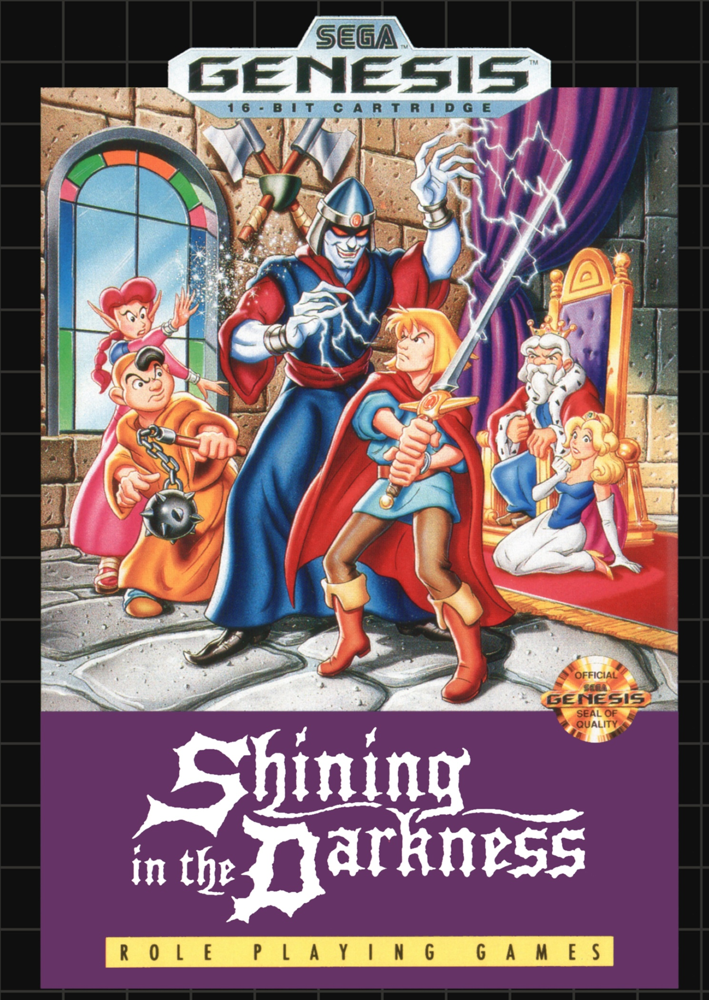
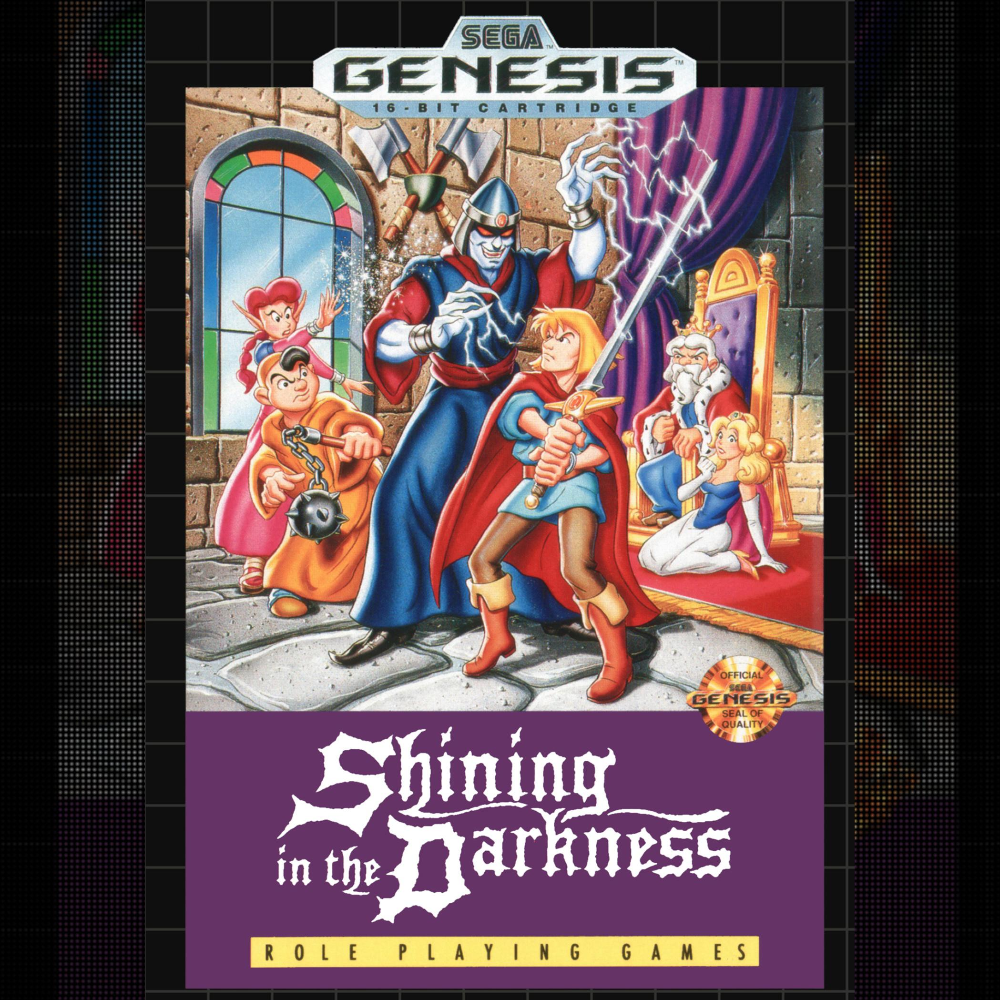
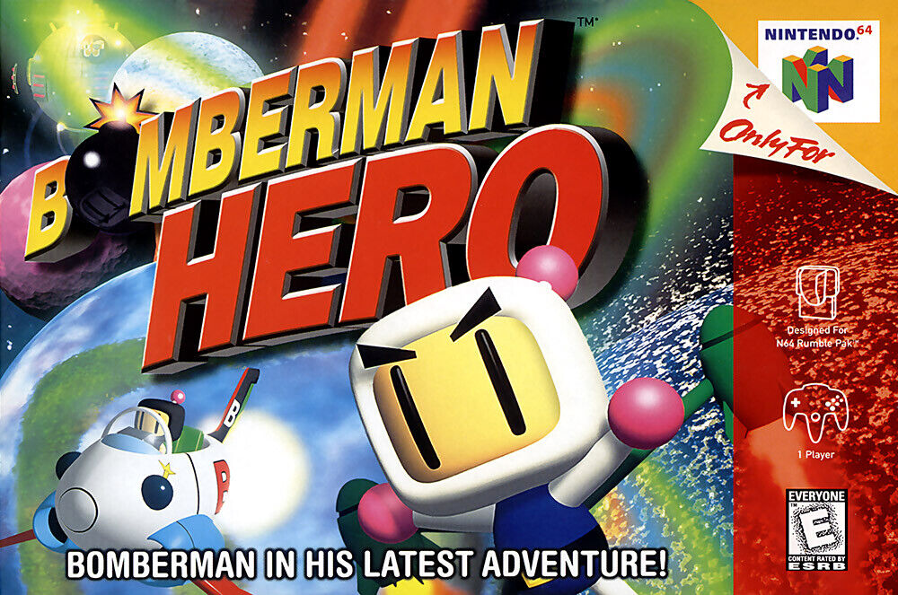
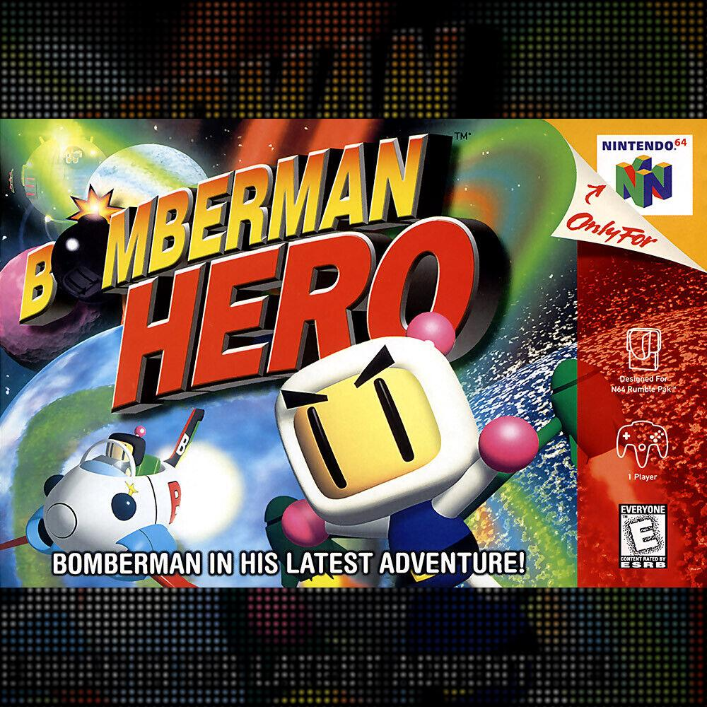
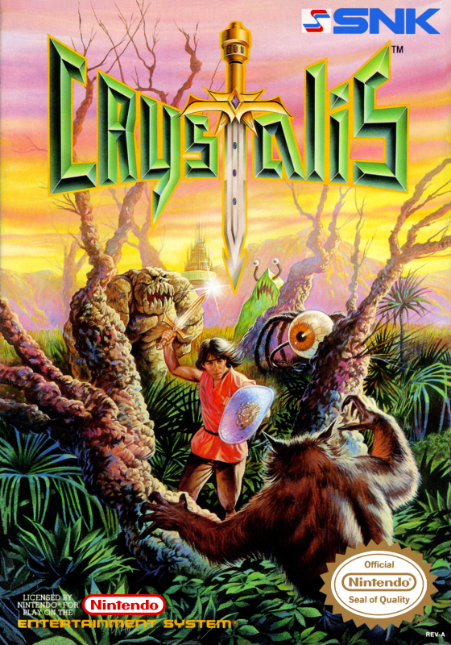
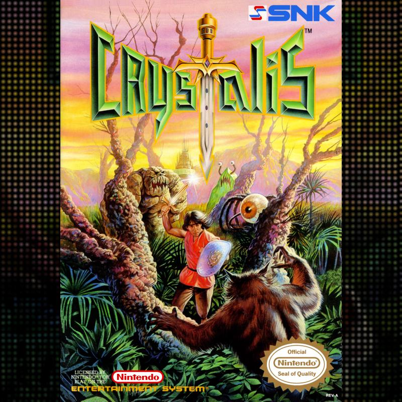
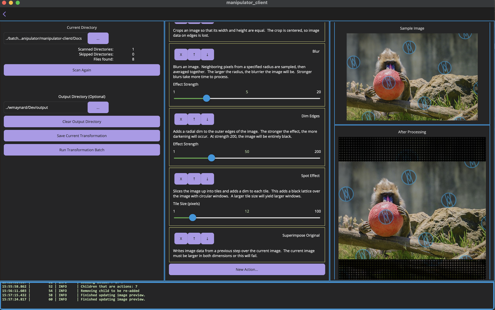
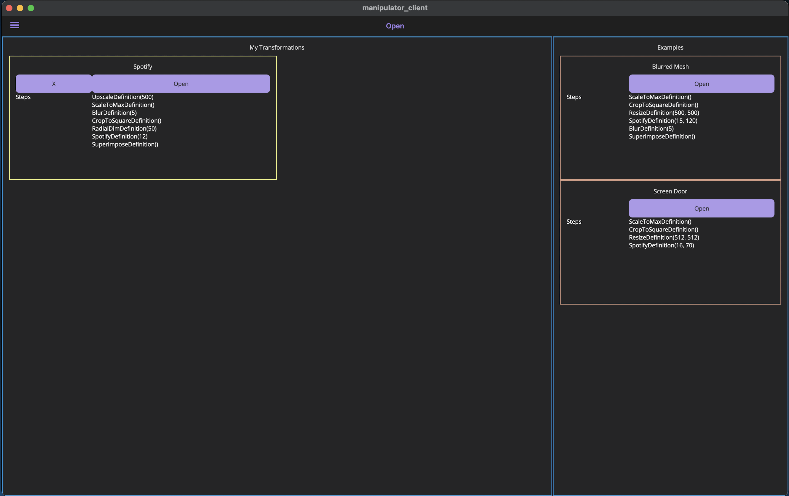
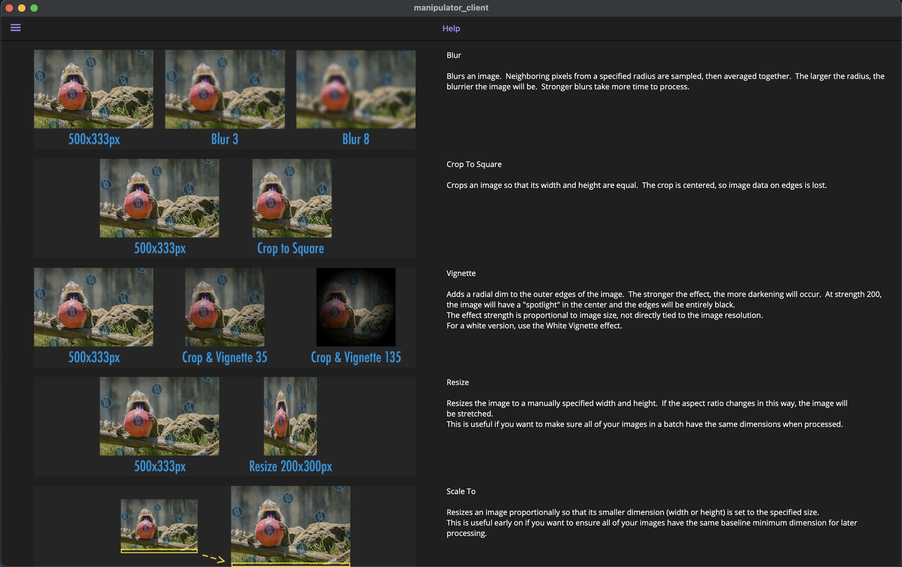

# Album Art Generator

A .NET MAUI learning project

## Introduction

I'm primarily a backend engineer.  I've spent the vast majority of my career designing databases, authoring APIs, and dealing with data flows - _not_ building native applications.  While I have experience in web frontends as part of my full-stack duties and side projects, I wanted to dive into .NET MAUI for a hobby project.  Making a tool for my own use is a better teacher than running through cookie cutter tutorials!

I have a large collection of video game music, and I run a Plex server to organize all of it.  I also spent a significant amount of time tagging my music collection with box art for album images; this way, when I'm picking game music, it feels like I'm pulling an old friend off my shelf.  Unfortunately, Plex doesn't support album art well if it's not square - the artwork will be cropped to the center, cutting off any detail on the sides.

One possible fix is to edit all of my images and put a plain or transparent square background behind all of them.  I wasn't entirely satisfied with this, though, since that results in a bland image.  I wanted my background to, in a way, extend the artwork.  If I didn't want to spend hundreds of hours manually editing images, I'd have to script my transformations.

Initially, I intended to create this project as just a CLI tool, but later decided it was a good opportunity for something more: an excuse to learn some new tools.

Is my app amazing?  No.  Far from it!  Do I have antipatterns?  Certainly!  Bugs?  Dozens!  I just wanted to use this as a jumping off point to learn new tech (MAUI).  While I might clean up my code a bit to leave it in an "okay" state, it'll never be polished without a rewrite.  If I revisit this in the future, knowing what I do now about MAUI, I'd be more deliberate in designing my elements and organization.  It's still a fun little learning project, and something that'll help me with my media library.

## Batch Image processing

Let's revisit the album art image above.  I mentioned I wanted a dynamic background that "extends" the album art.  Inspired by portrait videos displayed on landscape screens, I thought an upscaled and blurred image behind it would work well for my needs.

Once I had a blur working, I started playing around with other effects.  

| Unprocessed                                                             | Processed                                                                                     |
|-------------------------------------------------------------------------|-----------------------------------------------------------------------------------------------|
|  |  |
|                    |                    |
|                          |                          |

These processed images are the result of multiple transformations happening to the original image:

1. Scaling the original image up to its maximum dimension.  If the image is 500x800px, this yields a new image that's 800x1280px.
2. Crop the image to a square.  This creates our background image, 800x800px, that will serve as the basis for the required square album art.
3. Add a slight blur to the background.  This removes some focus from the background.
4. Add a vignette to the edges.  This further removes some focus from the background.
5. "Spotify" it - slice the image into tiles of a specified size, add a vignette to each tile, then stitch them all back together again.  This creates a "pixelated" kind of effect that's more interesting than a simple blur.
6. Superimpose the original image over the current background.  Since we matched the maximum dimension, the original image will stretch from one end to the other, but have our spotified, vignetted, and blurred background filling out the missing pixels to create a square image.

Most of my effects here are configurable.  In its original CLI form, it wasn't easy to configure my transformations - and I'd have to save them in a text file if I wanted to reuse them.  This is what gave rise to the primitive GUI I'd go on to make in this app.

## The GUI

It's nothing too special.  More focused on function than a great UX, there are three pages in total.  The **Transformation Page** is the meat of the application, responsible for configuring and processing images.

Sliders, numeric input boxes, and directory pickers allow a user to set up their transformation while seeing a preview update in not-so-real-time.  I'm not recreating Adobe's image processing performance... yet.

The **Transformation Page** also has a log output for debugging.  On release builds, only WARN-level events and above will be printed.

---

The **Open Page** is a very simple view of any saved user-generated transformations.  A few sample transformations are provided.

Each saved transformation describes each step of the transformation, although it's not particularly user-friendly since it uses method names and unnamed parameters from the code as opposed to UI strings.

---

Finally, the **Help Page** shows a visual example of what each transformation step will do to an image.

These are the same descriptions as those used when picking the individual action, but slightly extended.  Paired with screenshots of the effect it's hopefully a little more intuitive to understand.

## Initial Results

I'm satisfied with the results of my updated album art for my Genesis collection - one platform down, more than a dozen to go!

{PLACEHOLDER}

## Future of the Project

Honestly, there isn't likely to be one.  This only served as my tutorial into MAUI development and was never intended to be a "real" app.  It does what I need it to without any further work.  

But, if I do decide to revisit this (or if I embark on another MAUI project), here's a list of action items for future me:

1. Rewrite the UI and components from scratch.  I can definitely be smarter about the way I create modular building blocks.
2. Build "universal" controls.  MAUI is sadly lacking in otherwise common UI components, such as a drop down menu.  It's true that native components across different platforms won't agree on what default controls should be, so I'd need to make my own.  In this app, I didn't spend much time on my controls; if I got a slider to work with some labels, I moved on, and each of these controls deserves real thought and planning.
3. Target other platforms.  The power of MAUI is in its ability to create native apps for Windows, Android, iOS, and macOS, but here I settled on just macOS.  This is very likely going to be an early step in another MAUI project.
4. The image preview is very clunky as written, functional though it is.  Currently, any change to the transformation causes each stage to reprocess.  It would be a much nicer user experience to cache each stage and only update the image when necessary to avoid reprocessing the same, unchanging steps each time.
5. Unsurprisingly, performance leaves a lot to be desired.  Photoshop is able to process the same kinds of effects in a fraction of the time it takes the code in this project.  Most of the transformations here are processed pixel-by-pixel and is far from optimized, which causes timeouts, especially on larger images.  I didn't spend much time beyond an initial dive into ImageSharp, the library used for working with the image data, but there are certainly smarter ways to do this than iterating over every pixel.  As with leetcode-style problems, my approach is to get something working quickly, then polish it.
6. Add unit testing.  I ran into a handful of regression issues when I'd make changes - particularly to saving and loading transformations.  If I did want to make this multiplatform, it would be critical to catch those issues as early as possible.